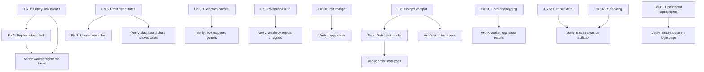

# Dilato Codebase Remediation Plan

This document provides a detailed, actionable plan for fixing all 16 issues identified during the codebase audit and subsequent ESLint/TypeScript diagnostics. Issues are ordered by severity (Critical → Low) and grouped into implementation phases to minimize context-switching.

---

## Phase 1: Critical Fixes (Must-do first)

### Fix 1 — Celery Task Name Mismatch

**Severity:** Critical  
**Files:** `app/tasks/amazon_tasks.py`, `app/tasks/ebay_tasks.py`, `app/tasks/order_sync.py`, `app/tasks/price_sync.py`, `app/tasks/stock_sync.py`, `app/tasks/sourcing_tasks.py`, `app/tasks/celery_app.py`

**Problem:** All Celery tasks declare `name="tasks.*"` (e.g., `name="tasks.sync_amazon_products"`) but `autodiscover_tasks(["app.tasks"])` expects the module path prefix `app.tasks.*`. Live worker logs confirm `KeyError: 'tasks.sync_ebay_orders'` — every beat-scheduled task is unregistered.

**Fix:** Remove the explicit `name=` parameter from every `@celery_app.task()` decorator. When no name is provided, Celery derives the task name from the module path (`app.tasks.amazon_tasks.sync_amazon_products`), which matches what autodiscover registers. Then update the `beat_schedule` in `celery_app.py` to use the auto-derived names.

**Changes:**

| File | Current | Target |
|------|---------|--------|
| `app/tasks/amazon_tasks.py:80` | `name="tasks.sync_amazon_products"` | Remove `name=` param |
| `app/tasks/amazon_tasks.py:186` | `name="tasks.refresh_amazon_prices"` | Remove `name=` param |
| `app/tasks/ebay_tasks.py:88` | `name="tasks.sync_ebay_listings"` | Remove `name=` param |
| `app/tasks/ebay_tasks.py:188` | `name="tasks.publish_ebay_listing"` | Remove `name=` param |
| `app/tasks/order_sync.py:40` | `name="tasks.sync_ebay_orders"` | Remove `name=` param |
| `app/tasks/price_sync.py:153` | `name="tasks.sync_amazon_prices"` | Remove `name=` param |
| `app/tasks/stock_sync.py:153` | `name="tasks.sync_amazon_stock"` | Remove `name=` param |
| `app/tasks/sourcing_tasks.py:29` | `name="tasks.run_sourcing_scan"` | Remove `name=` param |
| `app/tasks/celery_app.py:25` | `"task": "tasks.sync_amazon_products"` | `"task": "app.tasks.amazon_tasks.sync_amazon_products"` |
| `app/tasks/celery_app.py:29` | `"task": "tasks.sync_ebay_listings"` | `"task": "app.tasks.ebay_tasks.sync_ebay_listings"` |
| `app/tasks/celery_app.py:33` | `"task": "tasks.sync_ebay_orders"` | `"task": "app.tasks.order_sync.sync_ebay_orders"` |
| `app/tasks/celery_app.py:37` | `"task": "tasks.refresh_amazon_prices"` | `"task": "app.tasks.amazon_tasks.refresh_amazon_prices"` |
| `app/tasks/celery_app.py:41` | `"task": "tasks.sync_amazon_stock"` | `"task": "app.tasks.stock_sync.sync_amazon_stock"` |

**Verification:** Restart worker and beat containers, confirm tasks are registered with `celery -A app.tasks.celery_app inspect registered`, and check beat logs for successful dispatch.

---

### Fix 2 — Duplicate Celery Beat Task

**Severity:** Critical  
**File:** `app/tasks/celery_app.py`

**Problem:** The `beat_schedule` contains both `"refresh-amazon-prices"` (calling `tasks.refresh_amazon_prices`) and `"sync-amazon-prices"` (calling `tasks.sync_amazon_prices`) on the same interval. These are two different task functions (`refresh_amazon_prices` in `amazon_tasks.py` vs `sync_amazon_prices` in `price_sync.py`) that appear to do the same thing — sync Amazon prices with eBay listings. Running both doubles API calls and creates race conditions.

**Fix:** Remove the `"sync-amazon-prices"` entry from `beat_schedule`. The `refresh_amazon_prices` task in `amazon_tasks.py` is the more complete implementation (it uses the pricing rules pipeline). The `sync_amazon_prices` task in `price_sync.py` can be kept as a callable task but should not be scheduled automatically.

**Changes in `app/tasks/celery_app.py`:** Delete lines 44-47:
```python
# REMOVE THIS ENTRY:
"sync-amazon-prices": {
    "task": "tasks.sync_amazon_prices",
    "schedule": settings.PRICE_SYNC_INTERVAL,
},
```

**Verification:** Inspect `celery_app.conf.beat_schedule` after fix to confirm only one price-sync entry remains.

---

### Fix 3 — Auth Tests Broken by bcrypt/passlib Incompatibility

**Severity:** Critical  
**Files:** `requirements.txt`, `app/core/security.py`, `tests/api/test_auth.py`

**Problem:** All 9 auth tests fail with `ValueError: password cannot be longer than 72 bytes, truncate manually if necessary`. This is caused by a known incompatibility between `passlib==1.7.4` and `bcrypt>=4.1`. The `passlib` bcrypt handler passes the password without truncation, but newer `bcrypt` versions enforce the 72-byte limit strictly.

**Fix — Option A (Recommended):** Pin `bcrypt<4.1` in `requirements.txt` to restore passlib compatibility:

```
bcrypt<4.1
```

**Fix — Option B (Future-proof):** Replace passlib with direct `bcrypt` and `jose` usage. This is more work but eliminates the passlib dependency:

In `app/core/security.py`:
```python
import bcrypt

def verify_password(plain_password: str, hashed_password: str) -> bool:
    return bcrypt.checkpw(plain_password.encode("utf-8"), hashed_password.encode("utf-8"))

def get_password_hash(password: str) -> str:
    salt = bcrypt.gensalt()
    return bcrypt.hashpw(password.encode("utf-8"), salt).decode("utf-8")
```

And update `requirements.txt`:
```
bcrypt>=4.1
# Remove: passlib[bcrypt]==1.7.4
```

**Recommendation:** Use Option A for immediate fix (one-line change), then schedule Option B as a follow-up. Option A unblocks all auth tests immediately.

**Verification:** Run `docker compose exec -T api pytest tests/api/test_auth.py -v` and confirm all 9 tests pass.

---

## Phase 2: High-Priority Fixes

### Fix 4 — Order Test Mocks Missing Required Fields

**Severity:** High  
**File:** `tests/api/test_orders.py`

**Problem:** 6 order endpoint tests fail with `ResponseValidationError` because mock `Order` objects are constructed without all fields required by the `OrderOut` schema. Missing fields include `shipping_cost`, `ebay_fee`, `fulfillment_status`, `amazon_purchase_url`, `purchase_cost`, `profit`, `margin_percent`, `amazon_order_id`, `purchased_at`, `tracking_number`, `carrier`, `payment_status`, `shipping_address`, `raw_payload`, `last_webhook_at`, `shipped_at`, `delivered_at`, `listing_id`, `buyer_username`.

**Fix:** Create a helper factory function in the test file that builds a complete `Order` instance with sensible defaults, then use it in all test functions.

**Changes in `tests/api/test_orders.py`:**

Add near the top of the file (after imports):
```python
_NOW = datetime.now(timezone.utc)

def _make_order(**overrides) -> Order:
    defaults = dict(
        id=1,
        ebay_order_id="order-123",
        buyer_username="buyer1",
        sale_price=Decimal("29.99"),
        quantity=1,
        shipping_cost=Decimal("0"),
        ebay_fee=Decimal("0"),
        status=OrderStatus.pending,
        fulfillment_status=FulfillmentStatus.not_started,
        listing_id=None,
        amazon_purchase_url=None,
        purchase_cost=None,
        profit=None,
        margin_percent=None,
        amazon_order_id=None,
        purchased_at=None,
        tracking_number=None,
        carrier=None,
        payment_status=None,
        shipping_address=None,
        raw_payload=None,
        last_webhook_at=None,
        shipped_at=None,
        delivered_at=None,
        created_at=_NOW,
        updated_at=_NOW,
    )
    defaults.update(overrides)
    return Order(**defaults)
```

Then replace every `Order(...)` construction in the file with `_make_order(...)` calls, only overriding fields relevant to each test.

**Verification:** Run `docker compose exec -T api pytest tests/api/test_orders.py -v` and confirm all tests pass.

---

### Fix 5 — Dashboard Auth setState in Effect Body

**Severity:** High  
**File:** `dashboard/lib/auth.tsx`

**Problem:** ESLint `react-hooks/exhaustive-deps` error — `setToken(saved)` is called synchronously inside a `useEffect` body instead of using a lazy state initializer. This causes an unnecessary re-render on mount.

**Fix:** Use lazy state initialization for `token` so the initial value is read from `localStorage` only once:

**Change in `dashboard/lib/auth.tsx`:**

Replace:
```tsx
const [token, setToken] = useState<string | null>(null);
```

With:
```tsx
const [token, setToken] = useState<string | null>(() => {
  if (typeof window !== 'undefined') {
    return localStorage.getItem(TOKEN_KEY);
  }
  return null;
});
```

Then simplify the `useEffect` to only call `fetchUser` when a token exists, removing the `setToken(saved)` call:

```tsx
useEffect(() => {
  if (token) {
    fetchUser(token).finally(() => setIsLoading(false));
  } else {
    setIsLoading(false);
  }
}, [token, fetchUser]);
```

**Verification:** Run `cd dashboard && npx eslint lib/auth.tsx` — the `react-hooks/exhaustive-deps` error should be gone.

---

### Fix 6 — Profit Trend Uses Fake Labels Instead of Dates

**Severity:** High  
**Files:** `app/schemas/schemas.py`, `app/services/profit_service.py`, `dashboard/lib/api.ts`, `dashboard/app/page.tsx`

**Problem:** `OrderProfitDetailOut` schema lacks a `created_at` field, so the dashboard profit trend chart falls back to `"Order 1"`, `"Order 2"` labels instead of real dates. The `Order` model already has `created_at`.

**Fix — Backend:** Add `created_at` to `OrderProfitDetailOut` in `app/schemas/schemas.py`:

```python
class OrderProfitDetailOut(BaseModel):
    order_id: int
    ebay_order_id: Optional[str] = None
    sale_price: Decimal
    shipping_cost: Optional[Decimal] = Decimal("0")
    ebay_fee: Optional[Decimal] = Decimal("0")
    purchase_cost: Optional[Decimal] = None
    profit: Optional[Decimal] = None
    margin_percent: Optional[Decimal] = None
    created_at: Optional[datetime] = None  # <-- ADD THIS

    model_config = ConfigDict(from_attributes=True)
```

Then verify `app/services/profit_service.py` — the `get_profit_details` function queries `Order` objects which already have `created_at`, so `from_attributes=True` will map it automatically.

**Fix — Dashboard:** Update `dashboard/lib/api.ts` to add `created_at` to the `OrderProfitDetailOut` interface:

```typescript
export interface OrderProfitDetailOut {
  order_id: number;
  ebay_order_id?: string;
  sale_price: number;
  shipping_cost?: number;
  ebay_fee?: number;
  purchase_cost?: number;
  profit?: number;
  margin_percent?: number;
  created_at?: string;  // <-- ADD THIS
}
```

Then update `dashboard/app/page.tsx` — replace the `aggregateProfitByDate` function to use real dates:

```typescript
function aggregateProfitByDate(details: OrderProfitDetailOut[]): { date: string; profit: number }[] {
  const map = new Map<string, number>();
  details.forEach((d) => {
    const profit = d.profit != null ? Number(d.profit) : 0;
    const dateKey = d.created_at ? d.created_at.slice(0, 10) : "Unknown";
    map.set(dateKey, (map.get(dateKey) ?? 0) + profit);
  });
  return Array.from(map.entries())
    .sort(([a], [b]) => a.localeCompare(b))
    .map(([date, profit]) => ({ date, profit }));
}
```

**Verification:** Run backend tests, then manually verify the dashboard chart shows date-based x-axis labels.

---

### Fix 7 — Unused Variables in Dashboard

**Severity:** High (ESLint warnings)  
**File:** `dashboard/app/page.tsx`

**Problem:** In `aggregateProfitByDate`, the `map` variable is populated inside `forEach` but never read (the function returns an index-based array instead). The `profit` variable inside `forEach` is also computed but never used.

**Fix:** This is resolved by Fix 6 above — the rewritten `aggregateProfitByDate` will actually use the `map` and `profit` variables. No separate change needed.

---

## Phase 3: Medium-Priority Fixes

### Fix 8 — Global Exception Handler Leaks Internal Details

**Severity:** Medium  
**File:** `app/main.py`

**Problem:** `_global_exception_handler` returns `str(exc)` in the response body, which can leak internal details like database connection strings, file paths, or SQL errors to clients.

**Fix:** Replace `str(exc)` with a generic message in production, while preserving the actual error in server logs:

```python
import logging

logger = logging.getLogger(__name__)

def _global_exception_handler(request: Request, exc: Exception):
    """Return a consistent structured error envelope for unhandled exceptions."""
    logger.exception("Unhandled exception on %s %s", request.method, request.url.path)
    return JSONResponse(
        status_code=500,
        content={"detail": "Internal server error", "status_code": 500},
    )
```

**Verification:** Confirm that a deliberate 500 error returns `{"detail": "Internal server error", "status_code": 500}` and that the traceback appears in the server logs.

---

### Fix 9 — Webhook Endpoint Has No Authentication

**Severity:** Medium  
**File:** `app/api/v1/endpoints/orders.py`

**Problem:** The `POST /api/v1/orders/webhook` endpoint is completely public with no verification that requests actually come from eBay. Any client could forge order data.

**Fix:** Add eBay signature verification middleware to the webhook endpoint. eBay signs webhook notifications with an HMAC-SHA256 signature in the `X-eBay-Signature` header.

Add a new dependency in `app/api/v1/endpoints/orders.py`:

```python
import hmac
import hashlib

def verify_ebay_webhook(secret: str):
    """Dependency that validates the eBay webhook signature header."""
    async def _verify(request: Request) -> Request:
        signature = request.headers.get("X-eBay-Signature")
        if not signature:
            raise HTTPException(status_code=401, detail="Missing webhook signature")
        body = await request.body()
        expected = hmac.new(secret.encode(), body, hashlib.sha256).hexdigest()
        if not hmac.compare_digest(signature, expected):
            raise HTTPException(status_code=401, detail="Invalid webhook signature")
        return request
    return _verify
```

Then add a config setting `EBAY_WEBHOOK_SECRET` and apply the dependency to the webhook route. For now, if the secret is not configured, log a warning and skip verification (so local development still works).

**Note:** This is a medium-severity fix because the webhook is already public. A simpler interim approach is to add IP allowlisting or a shared secret header check. The full HMAC approach should be implemented when eBay integration is production-ready.

---

### Fix 10 — `_sign_request` Return Type Annotation Wrong

**Severity:** Medium  
**File:** `app/services/amazon_api.py`

**Problem:** The function `_sign_request` at line 60 returns `auth_header, amz_date` (a tuple of two strings), but the return type annotation says `-> str`. This causes mypy/pyright errors and misleading IDE hints.

**Fix:** Update the return type annotation:

```python
def _sign_request(
    method: str,
    path: str,
    headers: Dict[str, str],
    payload: str,
    access_key: str,
    secret_key: str,
    region: str,
) -> tuple[str, str]:
```

Also update the docstring to document the return value as a tuple of `(authorization_header, amz_date)`.

**Verification:** Run mypy or pyright on the file to confirm no type errors.

---

### Fix 11 — RuntimeWarning: Coroutine Never Awaited

**Severity:** Medium  
**Files:** `app/tasks/amazon_tasks.py`, `app/tasks/ebay_tasks.py`, `app/tasks/order_sync.py`, `app/tasks/price_sync.py`, `app/tasks/stock_sync.py`, `app/tasks/sourcing_tasks.py`

**Problem:** All Celery task functions call `asyncio.run(_async_function())` but the inner async functions return `dict` values that are never used. More importantly, if any of these async functions raise exceptions that aren't caught, `asyncio.run()` may produce `RuntimeWarning: coroutine was never awaited` in edge cases.

**Fix:** This is actually working as designed — `asyncio.run()` does await the coroutine. The real concern is that the return value from `asyncio.run()` is discarded. Add explicit `result = asyncio.run(...)` and log it:

```python
def sync_amazon_products(self, ...):
    """Celery task to sync Amazon products via PA-API."""
    try:
        result = asyncio.run(_sync_amazon_products(...))
        logger.info("Amazon product sync completed: %s", result)
    except Exception as exc:
        logger.error("Amazon product sync failed: %s", exc)
        raise self.retry(exc=exc)
```

Apply this pattern to all 7 task functions.

**Verification:** Check worker logs after a sync run to confirm result logging appears.

---

## Phase 4: Low-Priority Fixes

### Fix 12 — No Python Linter Configured

**Severity:** Low  
**Files:** `pyproject.toml` (add config), `requirements.txt` (add deps)

**Problem:** The project has no Python linter configured. The dashboard has ESLint but the backend has no equivalent.

**Fix:** Add `ruff` as the Python linter (it replaces flake8, isort, and pyupgrade in one tool):

In `requirements.txt`, add:
```
ruff>=0.5.0
```

In `pyproject.toml`, add:
```toml
[tool.ruff]
target-version = "py311"
line-length = 120

[tool.ruff.lint]
select = ["E", "F", "W", "I", "UP", "B", "SIM"]
ignore = ["E501"]
```

Add a script section or Makefile target:
```
ruff check app/ tests/
ruff format app/ tests/
```

**Verification:** Run `ruff check app/ tests/` and confirm it reports findings (or a clean bill of health after other fixes are applied).

---

### Fix 13 — `.env.example` Missing POSTGRES_* Variables

**Severity:** Low  
**File:** `.env.example`

**Problem:** `docker-compose.prod.yml` expects `POSTGRES_USER`, `POSTGRES_PASSWORD`, and `POSTGRES_DB` environment variables, but `.env.example` does not define them. This causes production deployment failures.

**Fix:** Add the missing variables to `.env.example`:

```env
# ---------------------------------------------------------------------------
# PostgreSQL (required for docker-compose.prod.yml)
# ---------------------------------------------------------------------------
POSTGRES_USER=postgres
POSTGRES_PASSWORD=postgres
POSTGRES_DB=reseller
```

**Verification:** Run `docker compose -f docker-compose.prod.yml config` to confirm the variables are picked up.

---

### Fix 14 — Timezone Handling Inconsistency in `listing_service.py`

**Severity:** Low  
**File:** `app/services/listing_service.py`

**Problem:** `update_listing_status` uses `datetime.now(timezone.utc)` which returns a timezone-aware datetime, while other services and models use `datetime.utcnow()` or `lambda: datetime.now(timezone.utc)` as column defaults. Mixing aware and naive datetimes can cause comparison issues.

**Fix:** Standardize on timezone-aware UTC datetimes everywhere. In `listing_service.py`, the current code is actually correct — it uses `datetime.now(timezone.utc)`. The inconsistency is in `app/models/models.py` where some default lambdas also use `datetime.now(timezone.utc)`. Verify all model defaults are consistent and add `.replace(tzinfo=None)` if the PostgreSQL columns are `TIMESTAMP WITHOUT TIME ZONE`, or migrate columns to `TIMESTAMP WITH TIME ZONE`.

For now, the safest minimal fix is to ensure `listing_service.py` strips the timezone info before writing to the database if the column is timezone-naive:

```python
from datetime import datetime, timezone

# In update_listing_status:
if status == ListingStatus.active and not listing.started_at:
    listing.started_at = datetime.now(timezone.utc).replace(tzinfo=None)
if status == ListingStatus.ended:
    listing.ended_at = datetime.now(timezone.utc).replace(tzinfo=None)
```

However, the better long-term fix is an Alembic migration to make all `DateTime` columns `TIMESTAMP WITH TIME ZONE` and keep timezone-aware datetimes throughout. This should be tracked as a separate task.

**Verification:** Run backend tests and confirm no `TypeError` from comparing aware vs naive datetimes.

---

### Fix 15 — Unescaped Apostrophe in Login Page JSX

**Severity:** Low (ESLint error)
**File:** `dashboard/app/login/page.tsx`

**Problem:** Line 86 contains `Don't` with a bare apostrophe, which violates the `react/no-unescaped-entities` ESLint rule. JSX requires special characters like `'` to be escaped.

**Fix:** Replace the bare apostrophe with the HTML entity:

```tsx
// Line 86: Change from:
Don't have an account?{' '}
// To:
Don{"'"}t have an account?{' '}
```

Or use the `'` entity:

```tsx
Don't have an account?{' '}
```

**Verification:** Run `cd dashboard && npx eslint app/login/page.tsx` — the `no-unescaped-entities` error should be gone.

---

### Fix 16 — `auth.tsx` JSX Parsed as `.ts` by Toolchain

**Severity:** High (TypeScript/ESLint compilation errors)
**File:** `dashboard/lib/auth.tsx`

**Problem:** VS Code reports multiple errors on line 137 (`return <AuthContext.Provider value={value}>{children}</AuthContext.Provider>`):
- `Cannot find namespace 'AuthContext'` (TS2503)
- `Parsing error: '>' expected` (ESLint)
- `'>' expected` (TS1005)
- `';' expected` (TS1005)
- `Expression expected` (TS1109)
- `Operator '<' cannot be applied to types 'boolean' and 'RegExp'` (TS2365)
- `Unterminated regular expression literal` (TS1161)

These errors all stem from the same root cause: the file contains JSX but the TypeScript/ESLint toolchain is treating it as a `.ts` file instead of `.tsx`. The file is correctly named `auth.tsx`, but the import paths in other files may be importing it as `auth.ts` without the extension, or the ESLint config may not be including `.tsx` files properly.

**Fix — Step 1:** Verify that all imports of `auth.tsx` use the correct path. Check files that import from `@/lib/auth` — they should use `@/lib/auth` (without extension), which Next.js resolves correctly for `.tsx` files.

**Fix — Step 2:** Verify `tsconfig.json` has `"jsx": "preserve"` or `"jsx": "react-jsx"` in compilerOptions, and that `.tsx` files are included in the `include` array.

**Fix — Step 3:** Verify `eslint.config.mjs` includes `.tsx` in its file patterns. If it only matches `.ts` files, JSX will fail to parse.

The actual code on line 137 is correct JSX:
```tsx
return <AuthContext.Provider value={value}>{children}</AuthContext.Provider>;
```

This is likely a tooling configuration issue rather than a codebase bug, but it should be verified that:
1. No import references `@/lib/auth.ts` (should be `@/lib/auth` or `@/lib/auth.tsx`)
2. `tsconfig.json` `jsx` setting is correct
3. `eslint.config.mjs` includes `.tsx` in its file patterns

**Verification:** Run `cd dashboard && npx tsc --noEmit` and `npx eslint lib/auth.tsx` to confirm no errors.

---

## Implementation Order Summary

The recommended implementation order groups changes by file to minimize context-switching:

| Step | Fix | Files Touched | Severity |
|------|-----|---------------|----------|
| 1 | Fix 1: Celery task names | 7 task files + celery_app.py | Critical |
| 2 | Fix 2: Duplicate beat task | celery_app.py (same file as step 1) | Critical |
| 3 | Fix 3: bcrypt/passlib compat | requirements.txt, security.py | Critical |
| 4 | Fix 4: Order test mocks | test_orders.py | High |
| 5 | Fix 5: Auth setState in effect | auth.tsx | High |
| 6 | Fix 6: Profit trend dates | schemas.py, profit_service.py, api.ts, page.tsx | High |
| 7 | Fix 7: Unused variables | page.tsx (resolved by Fix 6) | High |
| 8 | Fix 8: Exception handler leak | main.py | Medium |
| 9 | Fix 9: Webhook auth | orders.py | Medium |
| 10 | Fix 10: Return type annotation | amazon_api.py | Medium |
| 11 | Fix 11: Coroutine result logging | 6 task files | Medium |
| 12 | Fix 12: Python linter | pyproject.toml, requirements.txt | Low |
| 13 | Fix 13: .env.example vars | .env.example | Low |
| 14 | Fix 14: Timezone consistency | listing_service.py | Low |
| 15 | Fix 15: Unescaped apostrophe | login/page.tsx | Low |
| 16 | Fix 16: auth.tsx JSX tooling | auth.tsx, tsconfig.json, eslint.config.mjs | High |

---

## Dependency Graph



---

## Risk Assessment

| Fix | Risk | Mitigation |
|-----|------|------------|
| Fix 1 | Changing task names could break in-flight tasks | Drain task queues before deploying |
| Fix 2 | Removing duplicate task means only one price-sync path | Verify `refresh_amazon_prices` covers all needed behavior |
| Fix 3 | Pinning bcrypt version may conflict with other deps | Test in Docker build before merging |
| Fix 6 | Adding `created_at` to schema is backward-compatible | Existing clients ignore unknown fields |
| Fix 9 | Webhook auth could reject legitimate eBay calls if secret is wrong | Add feature flag / config toggle, test with eBay sandbox |
| Fix 14 | Timezone migration could affect existing data | Schedule as separate Alembic migration |
| Fix 16 | ESLint/TS config changes could affect other files | Run full `tsc --noEmit` and `eslint` after changes |